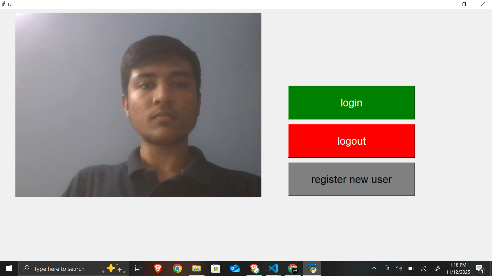
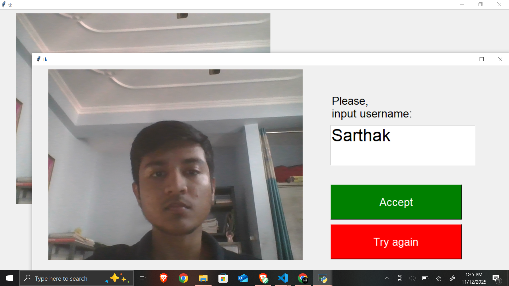
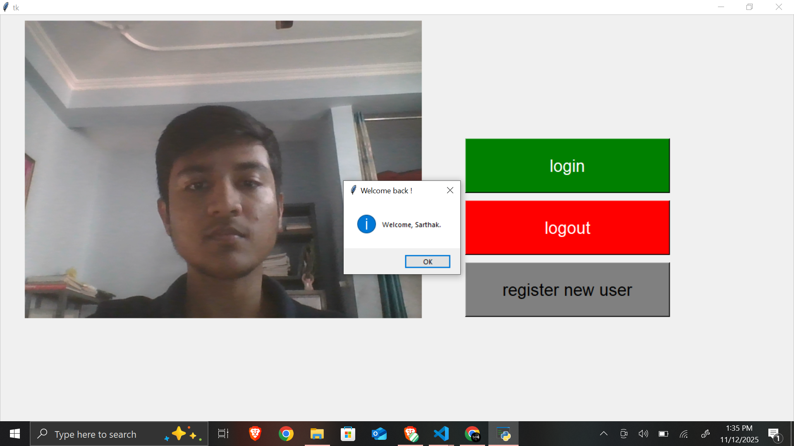
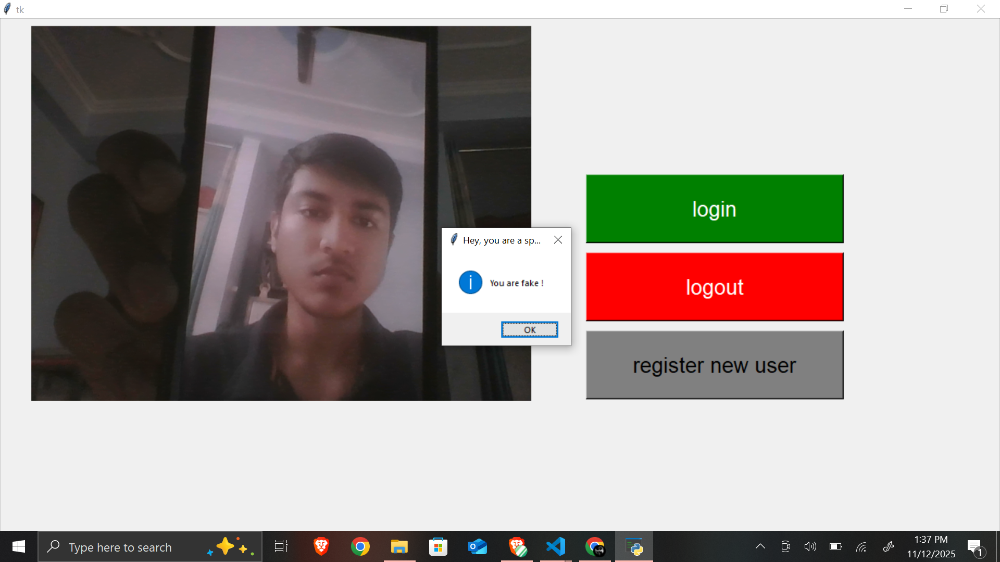

# Face-attendance-system with Anti-Spoofing

Face attendance system using face recognition with Python and Anti-Spoofing feature to detect fake faces !


## Screenshots
- App UI
  


- Registeration
  



- Trying to spoofing

  
## Execution

- Python 3.12
In Windows, you will need to do a couple of additional steps before starting with this code:

- Install the packages in requirements.txt in your terminal
```bash
  pip install -r requirements.txt
```
- Install all files from the github repo and save them in python directory.
- Run the main.py for the attendance system

## Spoofing feature

- we are using open source spoofing feature that we use to integrate in our project to overcome problem of spoofing
Refernce - https://github.com/minivision-ai/Silent-Face-Anti-Spoofing

